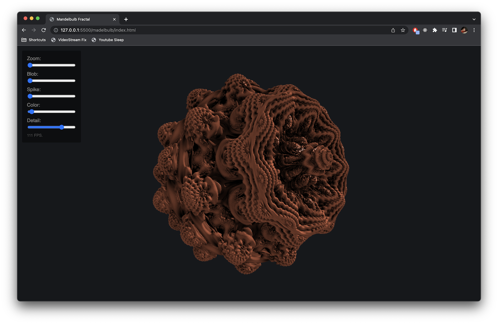
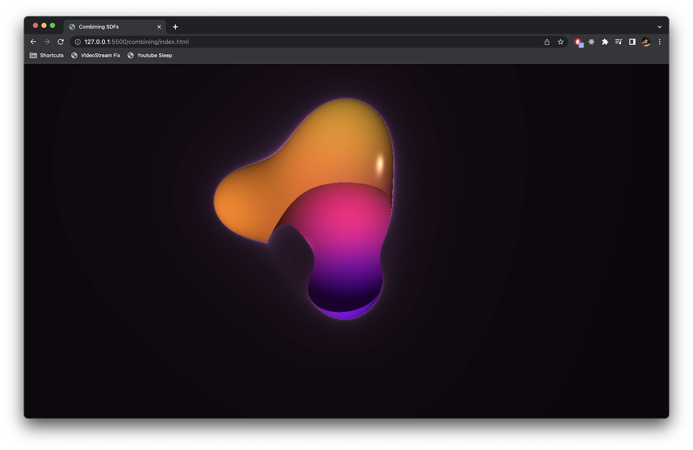

# Fractal WebGPU

This is a collection of little test projects to try out WebGPU.

The only library used is gl-matrix to simplify the view matrix math on the CPU side, everything else is done with pure WGSL.

## Demo

Open it in a browser with WebGPU support. [Which are those?](https://caniuse.com/webgpu)

[Live Demo.](https://zordone.github.io/fractal-webgpu/)

## 1. Mandelbulb Fractal

- Rendering the MandelBulb fractal by ray marching its SDF.
- Diffuse shading with specular highlights and ambient occlusion.
- Animated power parameter.
- Rotating light source.
- The scene can be rotated by dragging.
- Additional parameters can be changed by range inputs.

## 2. Combining SDFs

- Rendering multiple sphere SDFs.
- Combining them in different ways: union, intersection, smooth blending.
- Diffuse shading with Blinn-Phong specular highlights.

